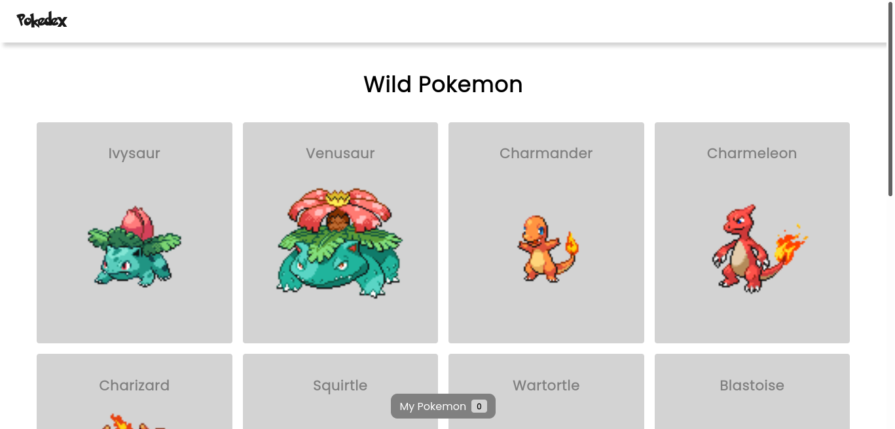
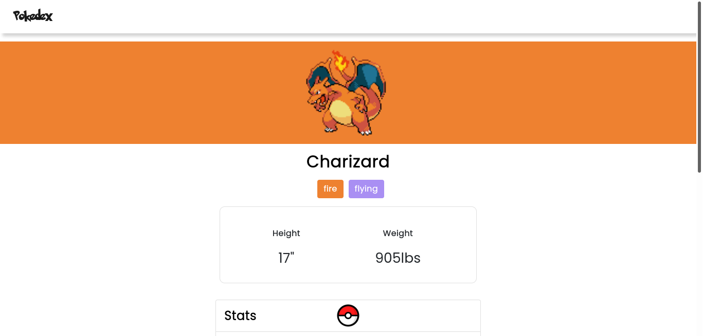
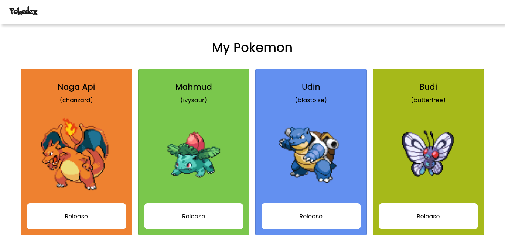

# Pokedex Web App

A pokedex-like web app that display a list of Wild Pokemon that you can catch, give a nickname and save as your Pokemon. It also display the details of each pokemon like types, height, weight, stats, and moves. This project was inspired from [react-pokemon](https://github.com/haris0/react-pokemon) that made by [haris0](https://github.com/haris0).

## Technologies

This project uses several technologies listed below:

- [React](https://reactjs.org/)
- [React Context](https://reactjs.org/docs/context.html)
- [React Router](https://reactrouter.com/)
- [Reactstrap](https://reactstrap.github.io/)
- [PokeAPI](https://pokeapi.co/)

## Project Setup

- Clone this repository
- Run npm install
- Run npm start

## Maintainer

- [Bagas](https://github.com/wahudamon)

## License

(c) 2021 Afwa Bagas Wahuda, under MIT License.
